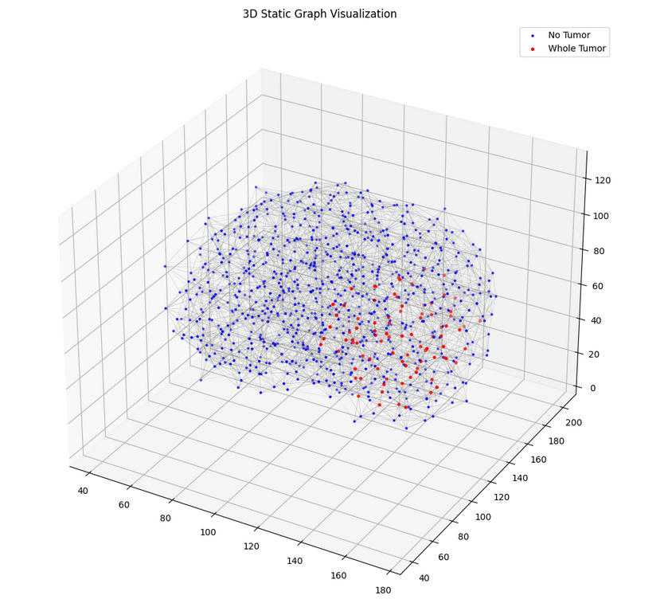
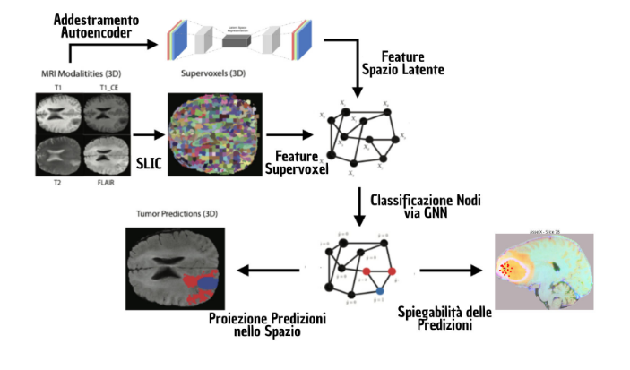
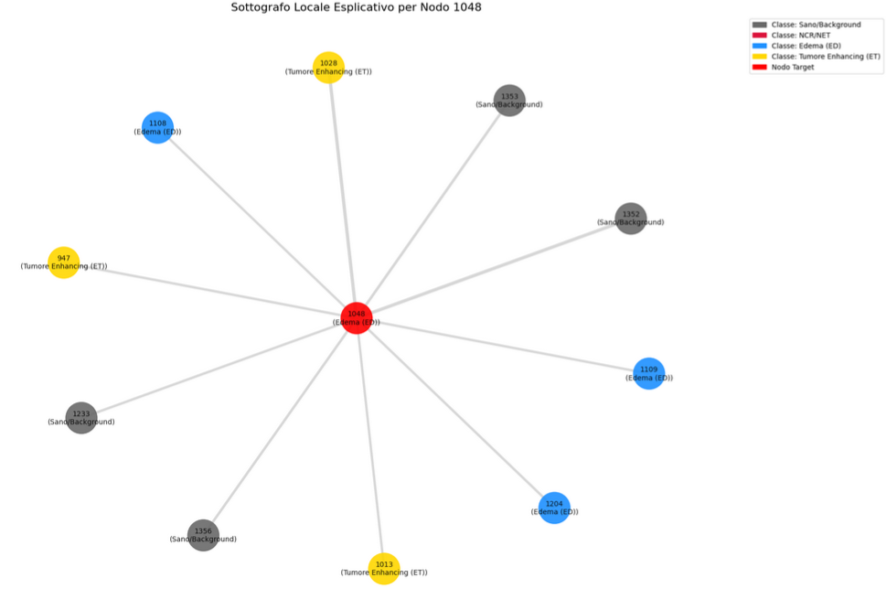
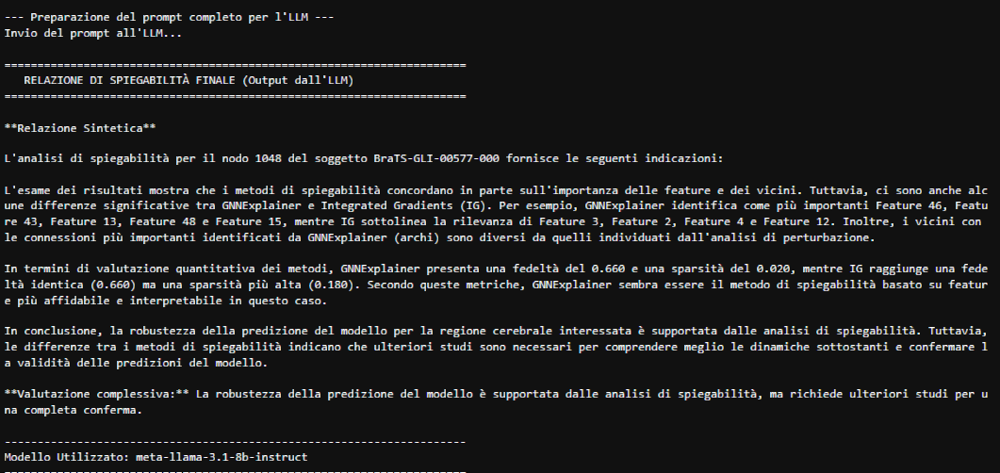

# Explainable GNNs for Brain Tumor Segmentation

[](https://opensource.org/licenses/MIT)

This repository contains the source code, notebooks, and findings from the thesis "Explainability of GNNs for Brain Tumor Segmentation: A Comparative Analysis of Methods and Metrics." This project explores the use of Graph Neural Networks (GNNs) as an accurate and interpretable tool for segmenting brain tumors from multi-modal MRI scans.

## Project Abstract

The "black-box" nature of deep learning models makes them hard to trust in clinical practice, especially for critical tasks like neuro-oncology. This project tackles this challenge by using **Graph Neural Networks (GNNs)** to build a brain tumor segmentation tool that is both accurate and easy to understand.

We developed and tested a complete pipeline on the **BraTS-2023** dataset, comparing three GNN architectures: GAT, GraphSAGE, and ChebNet. Our experiments show that **ChebNet** delivers the best performance, achieving an average Dice Score of 0.85. This is comparable to standard CNNs but with the added benefits of being more efficient and interpretable.

Our main contribution is a multi-method explainability analysis, where we compare **GNNExplainer**, **Integrated Gradients**, and perturbation techniques. Finally, we introduce a novel framework that uses a **Large Language Model (LLM)** to translate technical XAI outputs into simple narrative reports, making the results accessible to clinicians.

---

## Table of Contents

- [Background and Motivation](#background-and-motivation)
- [Key Contributions](#key-contributions)
- [Project Pipeline](#project-pipeline)
- [Main Results](#main-results)
- [Repository Structure](#repository-structure)
- [Installation and Usage](#installation-and-usage)
- [How to Cite](#how-to-cite)
- [Author](#author)
- [License](#license)

---

## Background and Motivation

Accurate brain tumor segmentation is crucial for diagnosis, surgical planning, and treatment monitoring. While Convolutional Neural Networks (CNNs) have achieved high performance, they are often "black boxes." This lack of transparency limits their reliability in clinical settings.

This project explores GNNs as an alternative by representing MRI scans not as a grid of pixels, but as a **graph of super-voxels**. This approach offers three main advantages:
1.  **Computational Efficiency**: Reduces the problem's complexity from millions of voxels to a few thousand nodes.
2.  **Modeling Relationships**: Explicitly captures the spatial and structural connections between brain regions.
3.  **Easier to Interpret**: The graph structure is a natural fit for Explainable AI (XAI), allowing us to see which regions (nodes) and connections (edges) were most important for a prediction.

<p align="center">
  
  <br>
  <em>Figure 1: A brain represented as a graph. This node-and-edge structure reduces complexity while preserving spatial relationships.</em>
</p>

## Key Contributions

-   **Comparative Analysis of GNNs**: A systematic evaluation of **GAT**, **GraphSAGE**, and **ChebNet** on the BraTS-2023 dataset.
-   **Complete Image-to-Graph Pipeline**: A full workflow that transforms 3D MRI volumes into graphs, including a **3D AutoEncoder** for latent feature extraction.
-   **Multi-Method Explainability (XAI) Framework**: A rigorous comparison of GNNExplainer, Integrated Gradients, and perturbation analysis to interpret the best model's decisions.
-   **LLM Integration for Narrative Explanations**: A novel system that translates technical XAI outputs into clear, human-readable text reports.

---

## Project Pipeline

Our method transforms each MRI scan into a graph, which is then used to train an explainable segmentation model.

<p align="center">
  
  <br>
  <em>Figure 2: A high-level diagram of the end-to-end project pipeline.</em>
</p>

The process follows these steps:
1.  **Data Preprocessing**: MRI scans from the **BraTS-2023** dataset (T1, T1ce, T2, FLAIR) are normalized, co-registered, and cropped.
2.  **Graph Construction**:
    -   **Nodes**: Each MRI volume is segmented into ~15,000 **super-voxels** using the SLIC algorithm. Each super-voxel becomes a node in the graph.
    -   **Node Features**: A 50-feature vector is created for each node, combining intensity statistics from the 4 MRI modalities and **latent features** extracted from a pre-trained 3D AutoEncoder.
    -   **Edges**: Connections between nodes are defined using a KNN (K=10) algorithm based on the spatial distance between super-voxel centroids.
3.  **GNN Training**: The GNN architectures are trained on a node classification task (healthy, edema, non-enhancing tumor, enhancing tumor).
4.  **Explainability (XAI) Analysis**: The best-performing model (ChebNet) is analyzed to identify the most important features and neighbors for its predictions.
5.  **Narrative Report Generation**: The XAI results are fed to an LLM to generate a text-based summary.

---

## Main Results

### Segmentation Performance

**ChebNet** significantly outperformed the other architectures, showing its strength in modeling the spatial relationships of tumors.

| Metric      | GraphSAGE | GAT  | **ChebNet**     |
| :----------- | :-------- | :--- | :-------------- |
| **Dice WT**  | 0.79      | 0.69 | **0.87**        |
| **Dice TC**  | 0.76      | 0.73 | **0.88**        |
| **Dice ET**  | 0.68      | 0.67 | **0.80**        |
| **HD95 WT (mm)** | 22.9      | 21.9 | **10.0**        |

### Explainability Analysis

-   Though they have similar fidelity, **Integrated Gradients (IG)** produces **sparser** (simpler) and therefore more interpretable explanations than GNNExplainer.
-   The model learns to base its decisions on a **local consensus**: a node's classification is heavily influenced by its neighbors of the same class.
-   The **LLM integration** proved effective at translating technical results into a qualitative and understandable format.

<p align="center">
  
  <br>
  <em>Figure 3: A local explanation for a node classified as "Edema." The thickness of the edges represents the connection's importance.</em>
</p>

<p align="center">
  
  <br>
  <em>Figure 4: A sample narrative report from the LLM, which summarizes technical data into clinically-oriented text.</em>
</p>

---

## Repository Structure

```
.
├── src/                  # Main source code
│   ├── models/           # GNN and AutoEncoder model definitions
│   ├── modules/          # Scripts for preprocessing, graph building, training, etc.
│   └── helpers/          # Utility functions
├── notebooks/            # Jupyter Notebooks for analysis, visualization, and XAI
├── data/                 # Raw data and processed graphs (not included in git)
├── images/               # Images used in the README and reports
├── reports/              # Generated explainability reports
├── saved/                # Trained models and logs
└── requirements.txt      # Project dependencies
```

---

## Installation and Usage

To replicate the findings of this project, follow the steps below.

### Prerequisites

-   Python 3.8+
-   PyTorch
-   PyTorch Geometric
-   MONAI
-   Scikit-learn, Nibabel, SimpleITK
-   (See `requirements.txt` for the full list)

### Installation

1.  Clone the repository:
    ```bash
    git clone https://github.com/your-username/brain-tumor-graph-segmentation-main.git
    cd brain-tumor-graph-segmentation-main
    ```

2.  Create and activate a virtual environment (recommended):
    ```bash
    python -m venv venv
    source venv/bin/activate  # On Windows: venv\Scripts\activate
    ```

3.  Install the dependencies:
    ```bash
    pip install -r requirements.txt
    ```

### Running the Code

The main workflows are managed through the Jupyter Notebooks in the `notebooks/` folder. It is recommended to open and run them in order to replicate the entire process:

1.  **Data Preprocessing and Graph Construction**: Open `1_Data_Preprocessing_and_Graph_Construction.ipynb` to process the MRI data and generate the graph files.
2.  **GNN Model Training**: Use `2_GNN_Model_Training.ipynb` to train the different GNN architectures (GAT, GraphSAGE, ChebNet).
3.  **Evaluation and Explainability**: Run `3_XAI_and_Evaluation.ipynb` to evaluate the best model, generate explainability analyses, and create the narrative reports.

---

## How to Cite

If you use this code or its results in your research, please cite the original thesis:

```bibtex
@mastersthesis{Lascaro2024GNN,
  author       = {Gianluca Lascaro},
  title        = {Spiegabilit{\`a} delle GNN nella Segmentazione dei Tumori Cerebrali: Un'Analisi Comparativa di Metodi e Metriche},
  school       = {Universit{\`a} degli Studi di Bari Aldo Moro},
  year         = {2024},
  note         = {Bachelor's Thesis in Computer Science. Supervisor: Prof. Gennaro Vessio; Co-Supervisor: Dr. Valerio Alberto Gaetano}
}
```

---

## Author

**Gianluca Lascaro**
-   GitHub: `[your-github-profile-url]`
-   LinkedIn: `[your-linkedin-profile-url]`

---

## License

This project is licensed under the MIT License. See the `LICENSE` file for more details.
